# VSCode（注意！目前只针对mac😅）

## 快捷键

> 光标移动
- 针对单词
    1. option + 左右方向键
       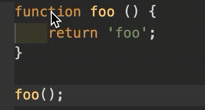
    2. 持续按下 Option + 方向键，在文档中以单词为单位不停移动
       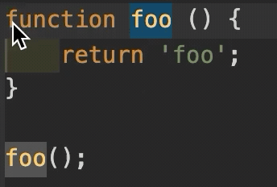
- 针对当前行
    Command + 左右 或者 fn + 左右
    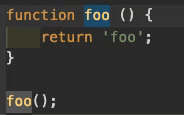
- 针对代码块
    Command + Shift + \
    多数编程语言都是用花括号将代码块包裹起来，比如if、for语句，当我们想通过一个快捷键实现在代码块始末快速跳转，可以使用
    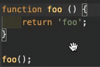
- 针对文档始末
    Command + 上下方向键
    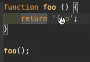

> 文本选择
1. 掌握上面快捷键后，只需在上面每个操作中多按一个Shift键，就可以在移动光标的同时选中其中的文本。
2. 通过鼠标：单击鼠标左键可以移动光标，双击鼠标左键会将当前光标下的单词选中，三连击鼠标左键可以选中当前行，四连击可以选中整个文档。
    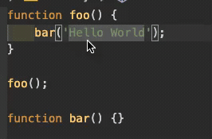
3. 拖动行号栏，选中文本
    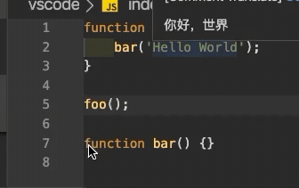

> 删除操作
1. Command + delete (删除光标左边)
   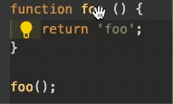
2. Command + Shift + K      (删除多行)
   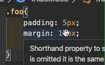

> 自定义

    vscode内置了很多的命令，但是并没有为每个命令都提供一个快捷键，毕竟快捷键的组合是有限的。
    可通过 首选项>键盘快捷方式 定义自己习惯的快捷键。

> 文本编辑
- 通过键盘
    1. Command + X (剪切)
    
    2. Command + C、V (复制粘贴)
- 通过鼠标
    1. 鼠标左键拖拽 (剪切+粘贴)
    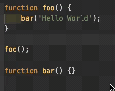
    <!-- 2. 鼠标左键拖拽 + Option键 (复制+粘贴)
     -->

> 开始新一行的代码
1. 当前行下面开始
    Shift + Enter
    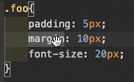
2. 当前行上面开始
    Shift + Command + Enter
    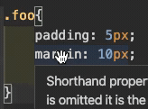

> 上下移动当前行

    Option + 上下方向键
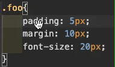

> 上下复制当前行

    同上操作的同时按住“Shift” Option + Shift + 上下方向键
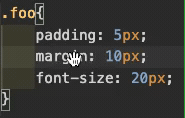

> 编程语言相关命令
- 添加注释（可以在js和css文件里面使用，这个命令会分别使用各自的语法去注释）
    1. 单行注释 Command + /
    2. 多行注释 Option + Shift + A
- 代码格式化
    1. 格式化整个文档 Option + Shift + F
       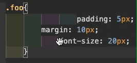
    2. 格式化选定内容 Command + K , Command + F
- 调整字符大小写
    选中一串字符，在命令面板中运行“转换为大写”或“转换为小写”。
    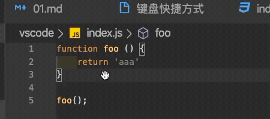
- 撤销光标的移动
    Command + U (有时候移动完光标后，突然希望把光标回退到上一个位置)    

> 创建多个光标 (推荐使用鼠标来创建光标)
- 鼠标方案1：Option + 鼠标
    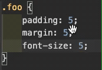
- 鼠标方案2：鼠标中间拖拽
    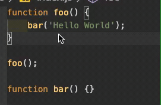
- 键盘方案1：
    1. 用 Option + Command + 下方向键连续创建多个光标
    2. Command + 右方向键，将光标全部移至行末
    3. 再用方向键移动至想编辑的地方
       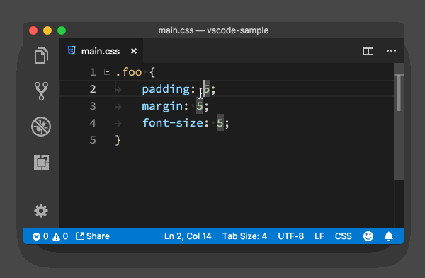
- 键盘方案2：
    先选中多行，再 Option + Shift + i
    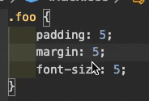

> 文件、代码、引用跳转
- 针对文件
    1. Ctrl + Tab (Tab页的切换)
    
    2. Command + P (支持搜索的文件跳转方式)
    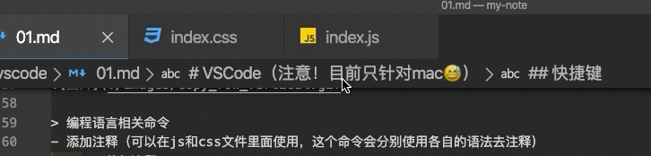
- 针对行
    1. Ctrl + G (调出输入框框后输入行数进行跳转)
    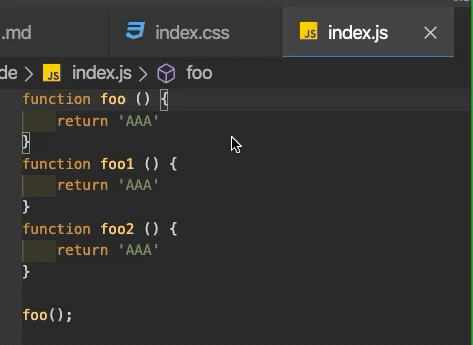
    2. Command + P (输入文件名后加上“:”和指定行号)
    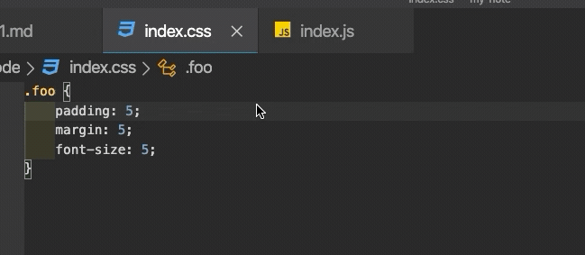
- 针对引用
    1. Shift + F12 (查看引用)
    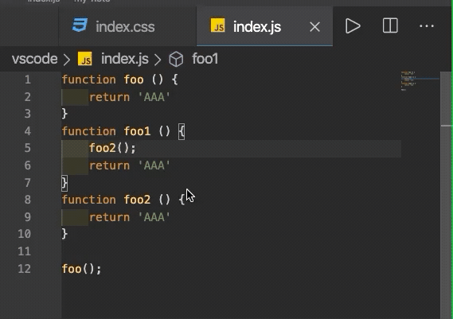
    2. Command + 鼠标左键 (跳转到函数实现位置)
    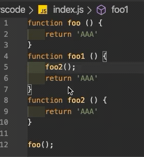

> 方法、变量重构

    F2 (当我们想修改一个函数或者变量时，只需把光标放到函数或变量上，按下F2，这样这个函数或变量出现的地方就都会被修改)
    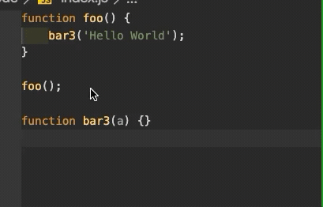

> 代码折叠
- 折叠展开当前代码块
    1. Option + Command + [ (折叠)
    2. Option + Command + ] (展开)
- 折叠全部：Command + K + 0
- 折叠全部第一级代码块：Command + K + 1
- 折叠全部第二级代码块：Command + K + 2
- 展开全部：Command + K + J
