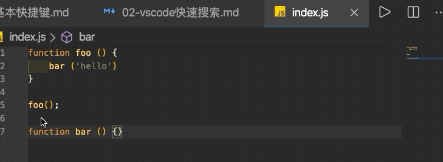

### 单文件

> 搜索：Command + F 或 Command + G

        快速调出搜索窗口，同时编辑器会将当前光标位置的单词自动填充到搜索框中。
        Command + F 与Command + G都可以调出搜索框。不同的是用前者调出搜索框后，光标会在搜索框中，后者光标会在编辑器中。
        Command + F 可通过按“enter”或“shift + enter”键会在所有搜索结果中跳转。
        Command + G 可通过连续按此快捷键在所有搜索结果中跳转。

- 搜索结果过滤
    1. 大小写敏感
    2. 全单词匹配
    3. 正则表达式匹配
        
    4. 文本选择范围内搜索
        
- 搜索结果替换
    1. 单个替换
    2. 全部替换
        

### 多文件

> 搜索：Command + Shift + F

    其功能同上，此处省略...